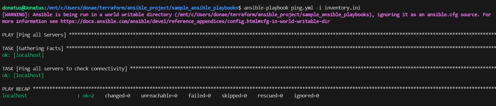

## Ansible Connectivity Lab

## Project Description
This project demonstrates my ability to use Ansible for basic server connectivity checks. It started as a learning exercise and evolved into a functional example of infrastructure automation.

## What I Learned

While building this, I worked through several real-world challenges:

1. Fixed permission issues when running Ansible through WSL

2. Configured proper inventory files

3. Debugged host connection problems

4. Set up local execution for testing

## How to Run This

- Ansible installed

- (Optional) WSL if testing on Windows
Clone this repository:

- git clone https://github.com/donaemeka/Ansible-Connectivity-project.git

- cd Ansible-Connectivity-project

## Run the connectivity test:

- ansible-playbook ping.yml -i inventory.ini

## Proof It Works

Here's the successful output from running the playbook:

## Screenshot shows all tasks completing with `ok` status